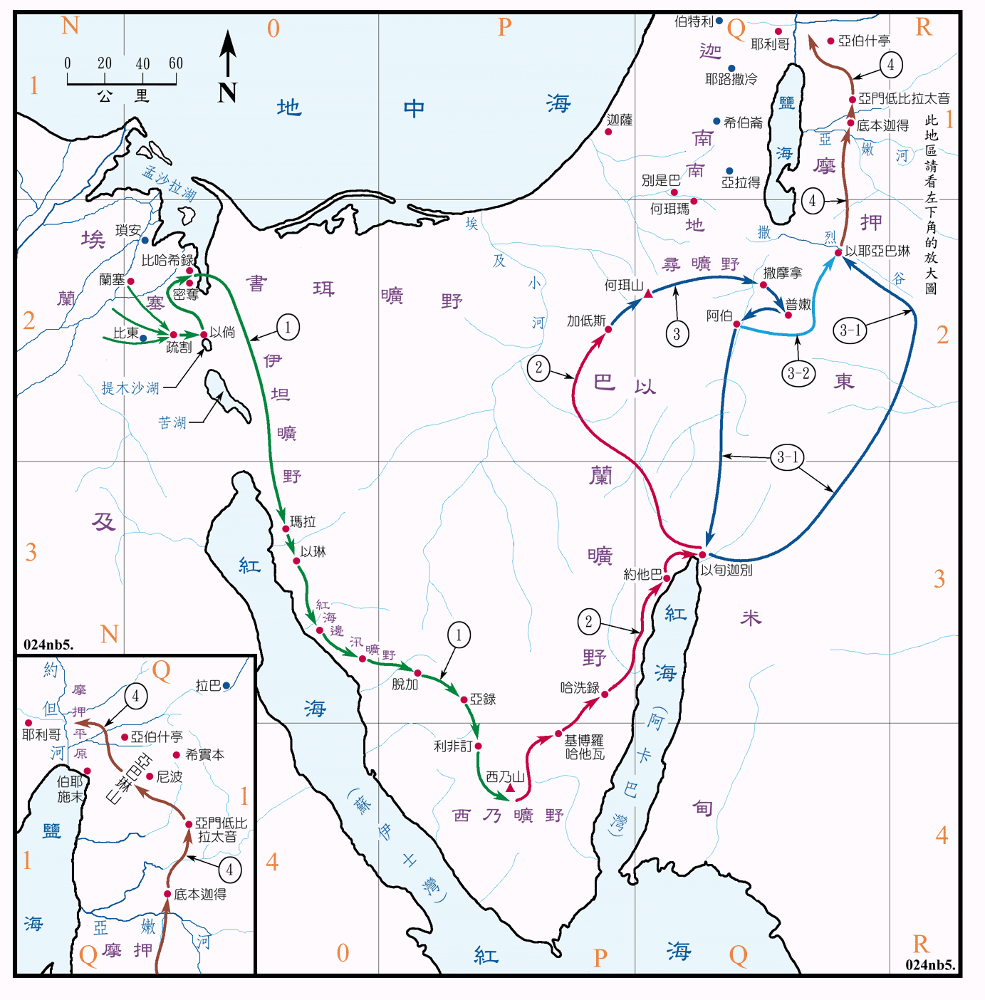

# 信仰的隘口_加低斯

## 開頭

加低斯這個地點很有趣，早在(Numbers 13:26)十二探子的事件中，以色列全會眾就已經聚集在加低斯，然而直到(Numbers 20:22)以色列全會眾才從加低斯起行。所以今天我想以加低斯作為主題來分享。


(Numbers 13:26)到了巴蘭曠野的加低斯，見摩西、亞倫，並以色列的全會眾，回報摩西、亞倫，並全會眾，又把那地的果子給他們看；  
(Numbers 20:22)以色列全會眾從加低斯起行，到了何珥山。  


十二探子的事件動搖了整個以色列出埃及的行程，因為這個事件，整個民族在曠野多待了40年，在這個信仰的關卡中，以色列人的工程被燒毀了(I Corinthians 3:15)，那些過去經歷的神蹟與恩典，並沒有讓他們真正的相信神，即使這些神蹟，緊湊的排列在這一年多的時間，他們仍舊不願相信最初的應許，只看見眼前的難題。


(I Corinthians 3:15)人的工程若被燒了，他就要受虧損，自己卻要得救；雖然得救，乃像從火裏經過的一樣。  


## 在加低斯_分別

(Numbers 13:26)回到以色列人第一次踏上加低斯的時刻，那天是個超大型集會，所有人迫不及待的想知道迦南地究竟是個怎樣的地方，40天前出發的探子已經回來，要回報那地的榮美，以及其瑕不掩瑜之處。探子們首先發布了好消息，(Numbers 13:27-29)那地方果然是流奶與蜜之地，但他們對於攻打這件事情，卻抱持著不同意見，(Numbers 13:30-33)迦勒主動安撫百姓，然而其他的探子似乎有著不同的居心，他們選擇向以色列全會眾報惡信。


(Numbers 13:26)到了巴蘭曠野的加低斯，見摩西、亞倫，並以色列的全會眾，回報摩西、亞倫，並全會眾，又把那地的果子給他們看；  
(Numbers 13:27-29)又告訴摩西說：「我們到了你所打發我們去的那地，果然是流奶與蜜之地；這就是那地的果子。 然而住那地的民強壯，城邑也堅固寬大，並且我們在那裏看見了亞衲族的人。 亞瑪力人住在南地；赫人、耶布斯人、亞摩利人住在山地；迦南人住在海邊並約旦河旁。」  
(Numbers 13:30-33)迦勒在摩西面前安撫百姓，說：「我們立刻上去得那地吧！我們足能得勝。」 但那些和他同去的人說：「我們不能上去攻擊那民，因為他們比我們強壯。」 探子中有人論到所窺探之地，向以色列人報惡信，說：「我們所窺探、經過之地是吞吃居民之地，我們在那裏所看見的人民都身量高大。 我們在那裏看見亞衲族人，就是偉人；他們是偉人的後裔。據我們看，自己就如蚱蜢一樣；據他們看，我們也是如此。」  


(Numbers 14:1-4)於是眾人大發怨言，甚至想要立一個首領回埃及地，這場動亂會不會是被策動的呢？有人想從神所選立的摩西手中奪權，在民數記中並沒有記載摩西所說的話，但他與亞倫俯伏在以色列人面前，(Deuteronomy 1:29-33)而摩西也安撫百姓，說神必為了你們爭戰，祂在等妳們來到這地方。


(Numbers 14:1-4)以色列眾人向摩西、亞倫發怨言；全會眾對他們說：「巴不得我們早死在埃及地，或是死在這曠野。 耶和華為甚麼把我們領到那地，使我們倒在刀下呢？我們的妻子和孩子必被擄掠。我們回埃及去豈不好嗎？」 眾人彼此說：「我們不如立一個首領回埃及去吧！」  
(Deuteronomy 1:29-33)我就對你們說：『不要驚恐，也不要怕他們。 在你們前面行的耶和華－你們的神必為你們爭戰，正如他在埃及和曠野，在你們眼前所行的一樣。 你們在曠野所行的路上，也曾見耶和華－你們的神撫養你們，如同人撫養兒子一般，直等你們來到這地方。』 你們在這事上卻不信耶和華－你們的神。 他在路上，在你們前面行，為你們找安營的地方；夜間在火柱裏，日間在雲柱裏，指示你們所當行的路。」  


然而會眾仍然毫不領情，(Numbers 14:10)他們選擇打死他們兩人，我其實在想這是指著約書亞迦勒還是摩西亞倫，但似乎不是那麼的重要，因為耶和華的榮光忽然顯現，並且在這個剎那我想到新約的一個聖經人物：保羅(Acts 9:3-7)他也曾被大光照耀，並與同行的人，聽見聲音卻說不出話也看不見人。

因此這些以色列全會眾都見證了，以及他們在想什麼？他們或許聽不到神對摩西說的話，也必聽見摩西答覆神的言語，他們大發怨言的對象，如今正為了百姓向那公義正直的神求情，為什麼？


(Numbers 14:10)但全會眾說：「拿石頭打死他們二人。」忽然，耶和華的榮光在會幕中向以色列眾人顯現。  
(Acts 9:3-7)掃羅行路，將到大馬士革，忽然從天上發光，四面照着他； 他就仆倒在地，聽見有聲音對他說：「掃羅！掃羅！你為甚麼逼迫我？」 他說：「主啊！你是誰？」主說：「我就是你所逼迫的耶穌。 起來！進城去，你所當做的事，必有人告訴你。」 同行的人站在那裏，說不出話來，聽見聲音，卻看不見人。  


我認為在這個情境下可以將以色列民分成五種到六種人，有摩西亞倫、約書亞迦勒、十個探子、會眾、利未人、以及閒雜人。

無論十個探子是為了爭權還是為了真的是害怕，他們的結局都已經定了，然而撕裂衣服的約書亞和迦勒呢？(Numbers 14:24)神對摩西說：唯獨我的僕人迦勒。總覺得這裡很巧妙，彷彿約書亞被忽視了，但卻是因為約書亞早已跟隨在摩西身邊，是屬乎神的人。


(Numbers 14:24)惟獨我的僕人迦勒，因他另有一個心志，專一跟從我，我就把他領進他所去過的那地；他的後裔也必得那地為業。  


另外我想繼續把故事聚焦在少數人身上，面對先行公義再好憐憫的神，摩西亞倫究竟在想什麼？又或者說摩西要拿什麼和神爭辯呢？然而**真正重要的是榮耀**(Numbers 14:13-19)，這不僅僅是祈求憐憫，因為事已至此必有懲罰，摩西巧妙的答覆並沒有扭轉以色列人的命運，這世代的他們同樣在曠野滅絕淨盡，唯有約書亞和迦勒得進迦南，並且這成為以色列人的轉捩點。

或者他們原訂將要從此地往北攻進迦南地，在出埃及的第二年，在摩西的帶領下征服迦南。然而所有人都被迫一起在曠野打轉40年，包括(Numbers 14:29-30)沒有被屬點的利未人以及約書亞迦勒，所以我想問，身為利未人的你，有著怎樣的心境去面對信仰軟弱的弟兄姊妹，因為我們的同工，是體貼軟弱者並與其同行的旅途。


(Numbers 14:13-19)摩西對耶和華說：「埃及人必聽見這事；因為你曾施展大能，將這百姓從他們中間領上來。 埃及人要將這事傳給迦南地的居民；那民已經聽見你－耶和華是在這百姓中間；因為你面對面被人看見，有你的雲彩停在他們以上。你日間在雲柱中，夜間在火柱中，在他們前面行。 如今你若把這百姓殺了，如殺一人，那些聽見你名聲的列邦必議論說： 『耶和華因為不能把這百姓領進他向他們起誓應許之地，所以在曠野把他們殺了。』 現在求主大顯能力，照你所說過的話說： 『耶和華不輕易發怒，並有豐盛的慈愛，赦免罪孽和過犯；萬不以有罪的為無罪，必追討他的罪，自父及子，直到三、四代。』 求你照你的大慈愛赦免這百姓的罪孽，好像你從埃及到如今常赦免他們一樣。」  
(Numbers 14:29-30)你們的屍首必倒在這曠野，並且你們中間凡被數點、從二十歲以外、向我發怨言的， 必不得進我起誓應許叫你們住的那地；惟有耶孚尼的兒子迦勒和嫩的兒子約書亞才能進去。  


我不知道利未人中有沒有人發怨言，並且有沒有被神懲罰，然而我相信在會眾中，不會所有人都發怨言，就算沒有任何支持約書亞迦勒的人，也一定有人在一旁聊天、發呆、甚至討論今天的晚餐說：哎呀~嗎哪今天要不要烤成鬆餅呢？就好像今日的講台上，不會所有人都關注教會發生的事件，而台下除了聚會當然也不可避免的要有滑手機與睡覺的行為。

然而在神的眼中，這所有的會眾都是同罪，同樣不能進入迦南地，以只要你沒有像約書亞迦勒一樣，跳出來撕裂衣服說話並(Revelation 18:4)持定神的立場，今天你就無法過關，進入那應許的迦南美地。


(Revelation 18:4)我又聽見從天上有聲音說： 我的民哪，你們要從那城出來， 免得與她一同有罪，受她所受的災殃；  


## 在何珥瑪_毀滅

(Numbers 14:40)於是做錯事的以色列人想要彌補，他們衝上南地，卻被大大的殺敗，40年前的故事宣告終結，然而40年後的故事卻又在此地重新展開。(Numbers 21:3)他們在過去被毀滅的地方，戰勝了仇敵，並且展開了前往迦南地最後的旅途。

其實不只是信仰上而已，生活上的彌補往往也是毫無效果的，然而就跟考試沒過一樣要補考，有時信仰的跌倒終將引領我們回到同樣的隘口，(Revelation 2:5)行起初所行的事，直到考試通過為止。毫無疑問，新世代的以色列人在這裡開始，他們戰無不勝，甚至到征服迦南全地為止，只輸了艾城的那一戰，因為他們信心堅定。


(Numbers 14:40)清早起來，上山頂去，說：「我們在這裏，我們有罪了；情願上耶和華所應許的地方去。」  
(Numbers 21:3)耶和華應允了以色列人，把迦南人交付他們，他們就把迦南人和迦南人的城邑盡行毀滅。那地方的名便叫何珥瑪。  
(Revelation 2:5)所以，應當回想你是從哪裏墜落的，並要悔改，行起初所行的事。你若不悔改，我就臨到你那裏，把你的燈臺從原處挪去。  


## 在米利巴_爭鬧

當我們將視角從以色列民的身上轉移到摩西亞倫的身上時，我們不可避免的看到加低斯同樣成為他們的隘口，他們在此地跌倒，或者他們根本沒有不敬虔的意思，但他們同樣在信仰的隘口跌倒了。雖然這起事件毫無疑問是出於百姓的怨言，然而(Numbers 20:1-2)姊姊米利暗的死或多或少也影響了摩西的情緒管理。


(Numbers 20:1-2)正月間，以色列全會眾到了尋的曠野，就住在加低斯。米利暗死在那裏，就葬在那裏。 會眾沒有水喝，就聚集攻擊摩西、亞倫。  


神的話語與原則是不容更動的，在摩西擊打磐石的記載中，神要求的是吩咐，摩西所行卻是擊打。

我們不能很清楚的判斷是摩西不相信神用吩咐的就可以做到，還是這是一種經驗，又或者是心理繁亂以至於失了分寸，他很少見的用(Numbers 20:10)背叛和我為你們來敘述句子，回顧起初在紅海分開時，摩西說的是耶和華必為你們征戰。但是(Psalms 106:32-33)情緒卻不能成為我們不遵吩咐的藉口，就好像我們不能被情慾惹動，去做可羞恥的事，因為我們乃要榮耀神(Numbers 20:12)。


(Numbers 20:10)摩西、亞倫就招聚會眾到磐石前。摩西說：「你們這些背叛的人聽我說：我為你們使水從這磐石中流出來嗎？」  
(Psalms 106:32-33)他們在米利巴水又叫耶和華發怒， 甚至摩西也受了虧損， 是因他們惹動他的靈， 摩西 用嘴說了急躁的話。  
(Numbers 20:12)耶和華對摩西、亞倫說：「因為你們不信我，不在以色列人眼前尊我為聖，所以你們必不得領這會眾進我所賜給他們的地去。」  


## 結語

信仰的旅程就好像是一條繩子綁著我們與作為標竿的耶穌基督，我們所有人都可以選擇，要拉著繩子繞著圓圈，彷彿圓周運動一般，裝做自己有在靠近神，其實總是離神很遠；也可以一步一腳印的朝著耶穌基督邁進，直到與耶穌相似。

在神面前，分別為聖是相當重要的一件事，利未人在西乃山分別出來，約書亞和迦勒在加低斯分別出來，並且分別是一種表態的過程，以至於成聖


網址 : [Bible Geography](https://biblegeography.holylight.org.tw/images/index/condensedbible/map/024.GIF)

<!-- 插入圖片並強制樣式 -->



