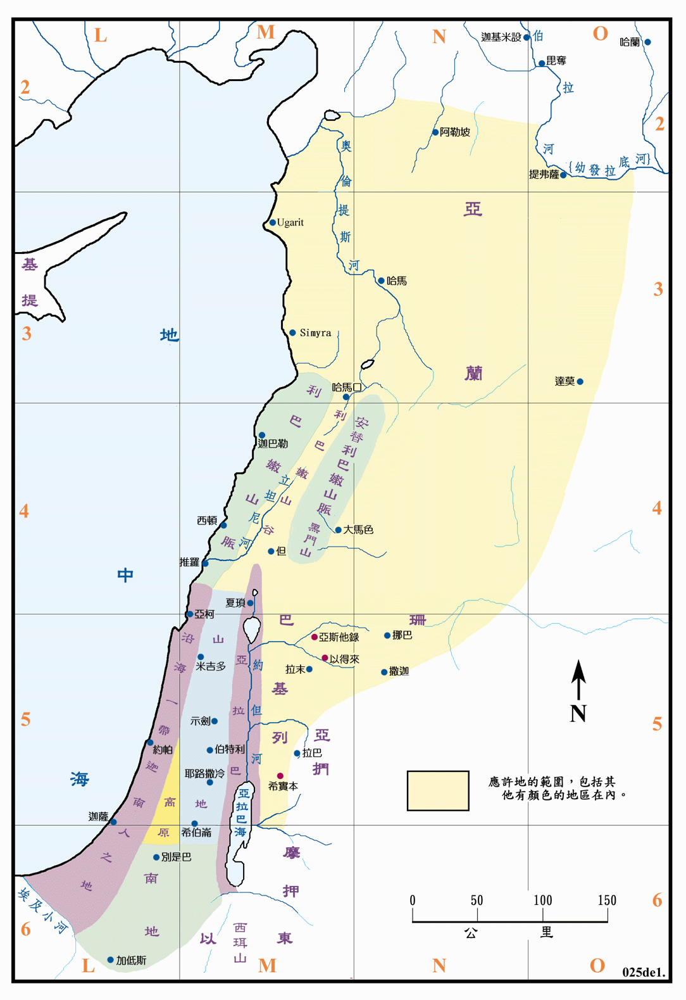

# 獻我一生_何西阿

## 背景

舊約聖經人物中，何西阿在希伯來文的意思是拯救，而摩西的接班人約書亞也曾叫何西阿，至於約書亞在希伯來文的意思是耶和華拯救，這兩個名字或許在本質上是相通的。何西阿先知的工作時間坐落在耶羅波安二世以及烏西雅以降的繁華時期，按照聖經對於亞伯拉罕的預言(Genesis 15:18-21)，那個從埃及小河直到伯拉大河的應許，大概只在所羅門王國時期以及現在這個時期成就。時代的背景處於大馬色[大馬士革]的亞蘭人逐漸沒落，而兩河流域的亞述人開始強盛起來的轉換階段，而同期主要服務猶大國的先知便是以賽亞。而(II
Kings 14:25-27)也記載到約拿先知也視同個時代的先知。


(Genesis 15:18-21)當那日，耶和華與亞伯蘭立約，說：我已賜給你的後裔，從埃及河直到伯拉大河之地，就是基尼人、基尼洗人、甲摩尼人、赫人、比利洗人、利乏音人、亞摩利人、迦南人、革迦撒人、耶布斯人之地。  
(II Kings 14:25-27)他收回以色列邊界之地，從哈馬口直到亞拉巴海，正如耶和華─以色列的神藉他僕人迦特希弗人亞米太的兒子先知約拿所說的。因為耶和華看見以色列人甚是艱苦，無論困住的、自由的都沒有了，也無人幫助以色列人。耶和華並沒有說要將以色列的名從天下塗抹，乃藉約阿施的兒子耶羅波安拯救他們。  


另外雖然耶戶王朝在耶戶做王的前期，便已經除滅了以色列國內的巴力(II Kings
10:28)，但仍然沒有離開尼八的兒子耶羅波安所鑄造的兩個金牛犢，而在經歷了這麼多的歲月，以色列人在沒有正統祭司(I Kings
12:31)的體制下，早已跟當地的傳統信仰逐漸結合，雖然這些對於現在來說實在很難體會，但這便是當時的時空背景。


(II Kings 10:28)這樣，耶戶在以色列中滅了巴力。  
(I Kings 12:31)耶羅波安在邱壇那裡建殿，將那不屬利未人的凡民立為祭司。  


## 娶淫婦為妻

神用婚姻來形容與以色列百姓的關係，這樣的看法不只出現在何西阿書，以西結書等也有相似的訊息，神對於宗教的不忠，視為婚姻的不忠；將信仰專一的仰望，視為婚姻專情的歸屬。

這邊要先小小提一下(Hosea 8:4)，以色列國的國王往往是由篡位而生，而何西阿作先知的時間其實相當的長，從猶大王朝的烏西雅直到希西家[以色列國被亞述所滅]，這之中有許多篡位的王，便是此處所否定的，所以歌篾所生的三個孩子，第一個名叫耶斯列[神栽種](Jeremiah 1:10)，是耶戶當初遵照神吩咐殺光亞哈家的人，堅固自己政權的地方，神也要在此處追討耶戶家族拜偶像的罪。


(Hosea 8:4)他們立君王，卻不由我；他們立首領，我卻不認。他們用金銀為自己製造偶像，以致被剪除。  
(Jeremiah 1:10)看哪，我今日立你在列邦列國之上，為要施行拔出、拆毀、毀壞、傾覆，又要建立、栽植。  


而第二個孩子名叫羅路哈瑪，用猶大國和以色列國的對比，不難看出在亞述的攻擊下，以色列國在何細亞亡國，而猶大國在倚靠耶和華的過程中得救。(II Kings
17:18)神將以色列人從自己眼前趕出，使他們不再成為子民，也就是第三個孩子名叫羅阿米。從這裡我們可以看出名字在舊約帶有深刻的涵義在，就連同一時期的以賽亞先知也將孩子取名叫瑪黑珥沙拉勒哈施罷斯(Isaiah 8:1)。


(II Kings 17:18)到神將以色列人從自己眼前趕出，不再成為子民。  
(Isaiah 8:1)則是提到以賽亞先知將孩子取名為瑪黑珥沙拉勒哈施罷斯。  


最後雖然歌蔑跑了，並且淪落為奴，何西阿仍將他贖回；就好像以色列人祭拜偶像直到被擄，最終仍被神重新建立，不過信仰有趣的地方便是這裡，與軟弱的人同心同行，將這件事情擺到現實生活中，甚至是物以類聚的看法裡，就好比最流行的AA制與朋友間的關係，如果高材生一直用艱澀難懂的詞彙炫耀，我想平凡人也很難跟他成為朋友，我不會說這是一種施捨，因為這是一種共同的約束與吃苦。我也實在沒有辦法想像，居然有人為了省一點錢，每次都使用甜心卡取代麥當勞套餐的作法，不過有一陣子真的省很多。

## 運用比喻

(Romans 1:28)神任憑這些作惡的人，仍舊行作惡的事，直到審判的時候。對比(Hosea 4:16)倔將的母牛的比喻，神也多次藉由先知傳達警告，但以色列人仍舊偏行己路，直到滅亡的地步。並用沒有翻過的餅(Hosea 7:8)表明以色列人雖在信仰上熱心，但方向明顯的錯誤，如同翻背的弓(Hosea 7:16)，毫無功用。


(Romans 1:28)他們既然故意不認識神，神就任憑他們存邪僻的心，行那些不合理的事。  
(Hosea 4:16)以色列倔強，猶如倔強的母牛；現在耶和華要放他們，如同放羊羔在寬闊之地。  
(Hosea 7:8)以法蓮與列邦人攙雜；以法蓮是沒有翻過的餅。  
(Hosea 7:16)他們歸向，卻不歸向至上者；他們如同翻背的弓。他們的首領必因舌頭的狂傲倒在刀下；這在埃及地必作人的譏笑。  


(Deuteronomy 32)我想拿申命記摩西寫的詩來對比以色列人在何西阿書(Hosea 11:1-4)的寫照，神明明藉由慈繩愛鎖牽引著以色列人，使他們明白，自由是有其一定的框架，然而不知足的心與(Hosea 4:1)毫不認識神的態度最終成為他們的絆腳石。

> 人生而自由，卻無處不身在枷鎖。___盧梭


(Hosea 11:1-4)以色列年幼的時候，我愛他，就從埃及召出我的兒子來。先知越發招呼他們，他們越發走開，向諸巴力獻祭，給雕刻的偶像燒香。我原教導以法蓮行走，用膀臂抱著他們，他們卻不知道是我醫治他們。我用慈繩（慈：原文作人的）愛索牽引他們；我待他們如人放鬆牛的兩腮夾板，把糧食放在他們面前。  
(Hosea 4:1)以色列人哪，你們當聽耶和華的話！因為耶和華與這地的居民爭辯，因為這地上無誠實，無良善，無人認識神。  


也因此，神藉由亞述人來出手管教(Hebrews 12:8)，或許他會回想起從前(Hosea 2:6-7)的美好而悔轉歸向神，然而唯有其中的智慧人能得拯救(Hosea 14:9)。


(Hebrews 12:8)管教原是眾子所共受的。你們若不受管教，就是私子，不是兒子了。  
(Hosea 2:6-7)因此，我必用荊棘堵塞她的道，築牆擋住她，使她找不著路。她必追隨所愛的，卻追不上；她必尋找他們，卻尋不見。便說：我要歸回前夫，因我那時的光景比如今還好。  
(Hosea 14:9)誰是智慧人，可以明白這些事；誰是通達人，可以知道這一切。因為，耶和華的道是正直的，義人必在其中行走，罪人卻在其上跌倒。  


## 問題討論

  1. 因我那時的光景比如今還好，真的嗎？

  2. 如此滔天大罪，個人真的有辦法得赦免嗎？

  3. 世界真的好快樂嗎？


(Jeremiah 44:16-18)論到你奉耶和華的名向我們所說的話，我們必不聽從。我們定要成就我們口中所出的一切話，向天后燒香、澆奠祭，按著我們與我們列祖、君王、首領在猶大的城邑和耶路撒冷的街市上素常所行的一樣；因為那時我們吃飽飯、享福樂，並不見災禍。  
(Hebrews 10:26)因為我們得知真道以後，若故意犯罪，贖罪的祭就再沒有了。  
(Hosea 4:10)他們吃，卻不得飽；行淫，而不得立後。  


## 結語

舊約中反覆且重複的論述，顯明了神愛的耳提面命，也揭示了人心始終悖逆。就連約拿的神蹟，也只能保護尼尼微城片刻。然而所獻的一生，不看成果，只看行動。


網址 : [Bible Geography](https://biblegeography.holylight.org.tw/images/index/condensedbible/map/025.GIF)

<!-- 強制插入圖片並置中樣式 -->



